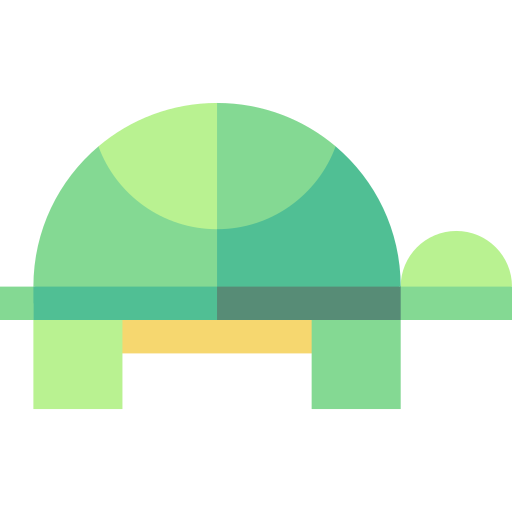

<h1 align="center" style="display: block; font-size: 2.5em; font-weight: bold; margin-block-start: 1em; margin-block-end: 1em;">
  <br><br><strong>TURTLE TUBE</strong><br>
  
  <br>Fault-Tolerant Leader-based Publish/Subscribe Replication System<br>
</h1>
<p align="center">
A reliable stream processing communication engine to enable ingesting and processing data in real-time within a distributed system <br><br>
</p>


## Table of contents[](#table-of-contents)
1. [Description](https://github.com/mt-cs/turtle-tube/edit/main/README.md#description-)
2. [Architecture](https://github.com/mt-cs/turtle-tube/edit/main/README.md#architecture-)
3. [Run Configurations](https://github.com/mt-cs/turtle-tube/edit/main/README.md#run-configurations-)
4. [Features](https://github.com/mt-cs/turtle-tube/edit/main/README.md#features-)
5. [Design Principles](https://github.com/mt-cs/turtle-tube/edit/main/README.md#design-principles-)
6. [Datasets](https://github.com/mt-cs/turtle-tube/edit/main/README.md#datasets-)

---

## Description[](#description)

**TURTLE TUBE** manages communication within a distributed network by ensuring reliability, fault-tolerant, and consistency within a leader-based replication in a publish/subscribe system. The system works on an assumption that all nodes have a crash stop model failure model with an accurate failure detector.

The TURTLE TUBE engine guarantees that:
* A failure of one application does not cause a crash of the system.
* The consumer are automatically notified about available leader status.
* All followers will catch up with replication during the join procedure.
* Strong consistency, a consumer must receive all messages in order.
* Options for pull-based and push-based consumers.
* Consumers can connect to followers and not just leaders.
* Persistent storage and send message log by offset
* Ensure the rf is maintained during node failure

---

## Architecture [](#architecture)


---

## Features[](#features)

> 💡 The TURTLE TUBE pub/sub system handles:

* Membership and failure detection using the bully algorithm and heartbeat gossiping system
* Reliability using ACK approach
* Inject failure to handle latency
* Synchronous and partial asynchronous replication 
* Leader-based system using bully election
* Dynamically add new instances of the Broker during program execution
* A pull-based Consumer API similar to the original Kafka design.


_Here are the TURTLE TUBE additional features:_
| Features | Description |
| --- | --- |
|**Persist Log to Disk and Use Byte Offsets as Message IDs**| Flush the segment files to disk only after a configurable number of messages have been published.|
|**Push-based Subscriber**| a Consumer to be push-based and the Broker be stateful. |
|**Replication factor**| The leader will replicate the topic to *rf* followers rather than all followers. |
|**Pull-based reads from followers**| A Consumer may connect to a follower to subscribe to a topic.|

---

## Run Configurations [](#run-configurations)

```
java -cp <jar file> ReplicationDriver -type <node type> -config <config json file> -log <output log file>
```

Run the main driver, `ReplicationDriver.java`, using different configurations specified in `./config`. For examples:

1. **Load Balancer**
```
java -cp dsd-project.jar ReplicationDriver -type loadbalancer -config config/configLoadBalancerReplication.json -log loadbalancer.log
```

2. **Broker**
```
java -cp dsd-project.jar ReplicationDriver -type broker -config config/configBrokerReplication1.json -log broker1.log
```

3. **Producer**
```
java -cp dsd-project.jar ReplicationDriver -type broker -config config/configProducerReplication1.json -log producer1.log
```

2. **Consumer**
```
java -cp dsd-project.jar ReplicationDriver -type broker -config config/configConsumerReplication.json -log consumer1.log
```

---

## Design Principles [](#design-principles)

### Messaging Framework with Fault Injection

TURTLE TUBE messaging framework provides the ability to send and receive messages over a network and to inject interfaces failure by losing or delaying messages.

#### Fault Injector

There are two implementations of the Sender's and Receiver's fault injector:
* Default Implementation: Send and receive as expected, failing only if the underlying network connection actually fails.
* Lossy Implementation: Allow the developer to inject interfaces failure. Specify a **loss rate** and a **delay parameter** for both sender and receiver.
  - Loss rate: specified as a decimal from 0 to 1, will define the probability that a message is lost in the network. A loss rate of .1 would indicate that an average of 10% of messages will be lost.
  - Delay parameter: specified as an integer delay, will define the maximum delay of a message in milliseconds. Assume actual delay is uniformly distributed from 0 to delay.

#### Communication

Communication happens over TCP using the java.nio AsynchronousChannel APIs.
TURTLE TUBE uses [Protocol Buffers](https://developers.google.com/protocol-buffers) to communicate between sender and receiver so that the `send`/`receive` messages wrap/unwrap the `byte[]` appropriately.

#### Concurrent Connection

A host is able to support any number of concurrent connections. Once a connection is established, a host is able to send and receive from that connection. Though a connection must be initiated by a client to a server, once the connection is established the hosts will behave as peers.

### Reliability
TURTLE TUBE's reliable data transfer protocol works over the `Lossy` connection messaging framework described above. A receiver host will ACKnowledge data as it is received, and a sender host will retransmit data that is detected as lost. This solution implements stop-n-wait protocol

### Publish/Subscribe System
#### Producer

`Producer` API may be used by an application running on any host that publishes messages to a broker. At minimum, `Producer` will allow the application to do the following:

1. Connect to a `Broker`
2. Send data to the `Broker` by providing a `byte[]` containing the data and a `String` containing the topic.

Following is an example of how the [Kafka](https://kafka.apache.org/) API supports this functionality.

```
// Create a properties object that specifies where to find the broker
// and how to serialize the data
Properties props = new Properties();
props.put("bootstrap.servers", "localhost:9092");
props.put("key.serializer", "org.apache.kafka.common.serialization.StringSerializer");
props.put("value.serializer", "org.apache.kafka.common.serialization.StringSerializer");

String topic = "my-topic"; //set the topic

// Create a producer using the properties specified
Producer<String, String> producer = new KafkaProducer<>(props);

// Use the send method to publish records to the topic
// Records are of the form key->value
// In this example records look like {"1" -> "1"}, {"2" -> "2"}, and so on
for (int i = 1; i < 100; i++) {
  producer.send(new ProducerRecord<String, String>(topic, Integer.toString(i), Integer.toString(i)));
}

producer.close();

```
The simplified API implementation omits the use of the Properties object and simply pass the relevant information into the Producer constructor. It also omits the use of generic types and assume that the send method accepts a byte[] of data. An example of a suggested simplified API is as follows:

```
// Open a connection to the Broker by creating a new Producer object
String brokerLocation = "localhost:9092";
Producer producer = new Producer(brokerLocation);

// Set the data and topic
byte[] data = ...;
String topic = "my-topic";

// Send data
producer.send(topic, data);
// Leave connection open until all data sent

// Close the connection 
producer.close();

```


#### Consumer

The `Consumer` API that may be used by an application running on any host that consumes messages from a broker. At minimum, the `Consumer` will allow the application to do the following:

1. Connect to a `Broker`
2. Retrieve data from the `Broker` using a pull-based approach by specifying a topic of interest and a starting position in the message stream

Following is an example of how the Kafka API supports this functionality. In this example, the subscribe method is how the consumer specifies one or more topics of interest and the auto.offset.reset property is how the consumer specifies to start at the beginning of the message stream.
```
// Create a properties object that specifies where to find the broker
// and how to serialize the data
Properties props = new Properties();
props.setProperty("bootstrap.servers", "localhost:9092");
props.setProperty("group.id", "test");
props.setProperty("enable.auto.commit", "false");
props.setProperty("auto.offset.reset", "earliest");
props.setProperty("key.deserializer", "org.apache.kafka.common.serialization.StringDeserializer");
props.setProperty("value.deserializer", "org.apache.kafka.common.serialization.StringDeserializer");

String topic = "my-topic";

// Create a consumer using the properties specified
KafkaConsumer<String, String> consumer = new KafkaConsumer<>(props);

// Subscribe the consumer to a list of topics
consumer.subscribe(Arrays.asList(topic));

// Forever...poll the next set of records from the consumer stream
while (true) {
	ConsumerRecords<String, String> records = consumer.poll(Duration.ofMillis(100));
	for (ConsumerRecord<String, String> record : records)
		System.out.printf("offset = %d, key = %s, value = %s%n", record.offset(), record.key(), record.value());
   }
}
```

Kafka uses the log offset rather than a message ID to identify a position in the message stream. In your solution, you may simplify this assumption and give each message a monotonically increasing integer ID. Below is the simplified API for Consumer"
```
// Specify the location of the broker, topic of interest for this specific
// consumer object, and a starting position in the message stream.
String brokerLocation = "localhost:9092";
String topic = "my-topic";
int startingPosition = 20;

// Connect to the consumer
Consumer consumer = new Consumer(brokerLocation, topic, startingPosition);

// Continue to pull messages...forever
while(true) {
	byte[] message = consumer.poll(Duration.ofMillis(100));
	// do something with this data!
}

// When forever finally finishes...
consumer.close();
```

In a real application, your  `Consumer` would do something with the data consumed. For demonstration purposes the consumer will just save it to a file. 

The final demonstration must include at least three `Consumer`applications running on three separate hosts. The choice of topic(s) should fully demonstrate the features of the application.


#### Broker

The `Broker` will accept an unlimited number of connection requests from producers and consumers. The basic `Broker` implementation* will maintain a thread-safe, in-memory data structure that stores all messages. The basic `Broker` will be stateless with respect to the `Consumer` hosts.

The assignment description specifies the application API that you must implement. It is up to you to design the communication protocol between the components of the system. An API-level method call will be translated into a message that will be sent over a connection between `Broker` and either `Producer` or `Consumer`. 

1. **May 9** - **Persist Log to Disk and Use Byte Offsets as Message ID** Basic implementation
2. **May 12** - **Push-based Subscriber** Design and implement a mechanism for a Consumer to register to receive updates to a topic. The Broker will proactively push out new messages to any registered consumers.
3. **May 15** - **Replication with persistent storage and push-based** Update persistent storage implementation to handle replication with snapshot using multiple files for each topic. Update push-based subscriber to handle node failure during replication.
4. **May 16** - **Pull-based reads from followers** A Consumer may connect to a follower to subscribe to a topic. If that follower fails, the Consumer will reconnect to active followers and specify its start point in the message stream
5. **May 17** - **Replication factor** Allow the creator of a topic to specify a replication factor (*rf*) for that topic. When a follower fails all topics it is storing must be redistributed to one or more other followers to ensure the rf is maintained

## Datasets [](#datasets)

Each application will mimic a front-end web server by replaying data from logs. Here are the data sets used to emulate web application log stream:
- [Kaggle](https://www.kaggle.com/eliasdabbas/web-server-access-logs)
- [Loghub](https://github.com/logpai/loghub)

<!-- markdownlint-enable -->
